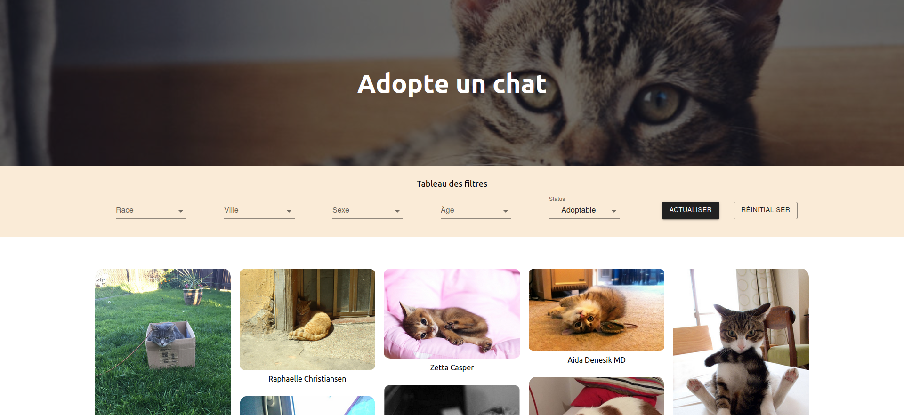

# CAT-ADOPT-APP

<center>
    
</center>

Dependance back:
```bash
express, request, cors
```

Dependance front:
```bash
axios, @mui/material
```

To start front (port: 3000):
```bash
cd front
npm install
npm start
```

To start back (port: 3001):
```bash
cd back
npm install
DEBUG=myapp:* npm start
```
